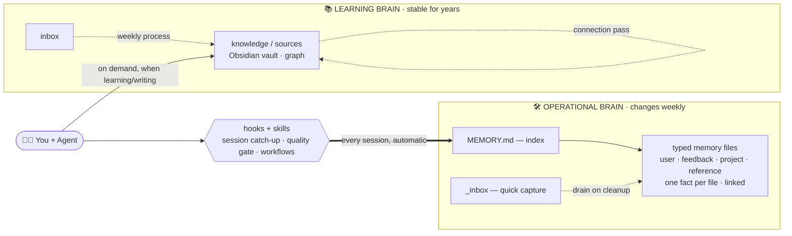

# Two Brains, Not One: An Operational Second Brain with Claude Code

> **TL;DR** — Most "second brain" writeups build a knowledge vault. That's only *half*. The other
> half is an **operational brain**: what's *in flight*, not what you *know*. Keep the two separate
> and each stays sharp. Below is the whole method — typed memory, an inbox, hooks, skills, and a
> cross-agent shared log — running daily on real client work.



Most "second brain with Claude Code" writeups build one thing: a knowledge vault — books,
articles, mental models, distilled into linked Markdown. That's useful. But after running an
AI-assisted setup daily for real client-delivery work (M&A IT integration — migrating tenants,
mailboxes, SharePoint, Teams across company mergers), I found that a knowledge vault is only
*half* of what a second brain needs to be.

The other half — the one nobody writes about — is an **operational brain**: not what you *know*,
but what is *in flight*. Which migration is at which stage. What broke last time and why. The
correction a colleague gave you three weeks ago that you must never forget. Which teammate-agent
is doing what right now.

This is how I run both, and why keeping them separate is the whole trick.

---

## The core distinction

| | Operational brain | Learning brain |
|---|---|---|
| Holds | in-flight state, decisions, corrections, gotchas | durable knowledge, concepts, mental models |
| Truth horizon | changes weekly | stable for years |
| Example | "project X is blocked on Y; resume with Z" | "second-order thinking: ask 'and then what?'" |
| Lives in | Claude Code's memory dir (`.claude/…/memory`) | an Obsidian vault |
| Read by | every session, automatically | on demand, when learning/writing |

Mixing them is the classic failure. Dump project status into your knowledge vault and it rots —
last month's blocker masquerades as a fact. Put durable concepts into your session memory and it
bloats until retrieval degrades. Separate them and each stays sharp.

---

## The operational brain

This is the part specific to *doing work with an agent*, and where the real leverage is.

**One fact per file.** Each memory is a single Markdown file holding one durable observation,
with frontmatter:

```markdown
---
name: <short-kebab-slug>
description: <one-line summary — used to decide relevance on recall>
metadata: { type: user | feedback | project | reference }
---
<the fact; link related memories with [[their-name]]>
```

**Four types, and the types matter:**

- `user` — who I am (role, preferences, expertise level).
- `feedback` — corrections and confirmed ways of working. *Always with the why.* "Never pre-fill
  the login field in connect commands — leave it empty, I enter the account manually." These are
  the memories that stop an agent repeating a mistake.
- `project` — ongoing work, goals, constraints not derivable from the code or git history.
- `reference` — pointers to durable technical facts and external resources.

The `feedback` type is the one most setups miss. An agent that remembers *corrections* — with the
reasoning behind them — compounds faster than one that just remembers facts.

**An index file** (`MEMORY.md`) with one line per memory, loaded every session. It's the map; the
individual files are the territory. The agent reads the index, decides what's relevant, opens only
those.

**A quick-capture inbox.** A single `_inbox.md` where half-formed facts land mid-work — zero
friction, no schema — to be drained into proper typed memories during periodic cleanup. Capturing
beats structuring-in-the-moment; structure later.

**Selective linking.** `[[wikilinks]]` between memories, but *tight* — link A to B only when
understanding A genuinely changes how you read B. A dense graph of topical overlap is noise; a
sparse graph of real dependencies is a second brain.

---

## The automation layer nobody mentions

Static Markdown is where most writeups stop. The operational brain gets its edge from *hooks* —
code the harness runs automatically:

- **Session catch-up.** On every session start, a hook surfaces what changed since last time —
  new commits (across every agent working the repos), handoff-doc edits — and stays silent when
  nothing's new. You sit down and the agent already knows what moved.
- **Quality gates.** A hook that runs after any script edit: syntax-parse it, lint for
  environment-specific footguns, block the obvious breakage before it's saved.

Hooks turn memory from a passive store into an active teammate.

---

## Skills: workflows as first-class objects

Beyond memory, repeatable procedures become **skills** — named, invokable workflows the agent
loads on demand. A pre-flight checklist before a risky operation. A project-closeout routine. A
"write the handoff doc so a fresh session resumes cleanly" procedure. Each encodes a workflow once
so it runs the same way every time, instead of being re-improvised.

The pattern that makes skills powerful: a skill can encode *your* hard-won rules, not generic best
practice. A pre-flight skill that checks the five things that have actually bitten you is worth
more than any vendor checklist.

---

## Two agents, one shared log

The setup runs two AI agents with different strengths, coordinated through an append-only shared
log both write to after meaningful work, plus a live task-handoff doc. One agent orchestrates and
builds; the other executes governed, sandboxed operations. The shared log is their second brain
*about each other* — so neither redoes what the other just did, and a human relays "your turn"
between them.

Cross-agent memory is the frontier most single-agent setups never reach, and it's where a lot of
wasted, duplicated work disappears.

---

## The learning brain (the other half)

The knowledge vault follows the well-trodden pattern — and it works:

- A schema file the agent reads first (`CLAUDE.md`) defining structure, frontmatter, and linking
  rules, so the system never needs re-explaining.
- `inbox/` → `knowledge/` (processed concept notes) + `sources/` (one note per book/article/course).
- Workflow: **capture** raw (seconds, no structure) → **process** weekly (agent files each item) →
  **connect** periodically ("what non-obvious links am I missing?") → **retrieve** by asking across
  the vault, browsing the graph in Obsidian.

The one improvement worth stealing back into the *operational* brain: the periodic **connection
pass**. Ask the agent to find the non-obvious cross-links you never wired — it surfaces
dependencies between projects and corrections you'd never spot by hand.

---

## Principles that actually moved the needle

1. **Separate what's in-flight from what's durable.** The single highest-leverage decision.
2. **Remember corrections, with the why.** `feedback` memories compound faster than facts.
3. **Capture with zero friction; structure later.** An inbox beats a blank schema.
4. **Link tightly.** A sparse graph of real dependencies beats a dense graph of topical overlap.
5. **Automate the boundaries.** Hooks on session-start and on-save turn memory active.
6. **Codify workflows as skills.** Encode your rules, not generic ones.
7. **If you run more than one agent, give them a shared log.** It's the biggest source of
   eliminated duplicate work.

---

*Written from a daily-driver setup used for M&A IT integration delivery. Everything here is method,
not tooling-specific — the same shape works whether your work is migrations, research, or writing.*

---

<sub>Shared as a method writeup. No tooling affiliation. Feedback and forks welcome.</sub>
